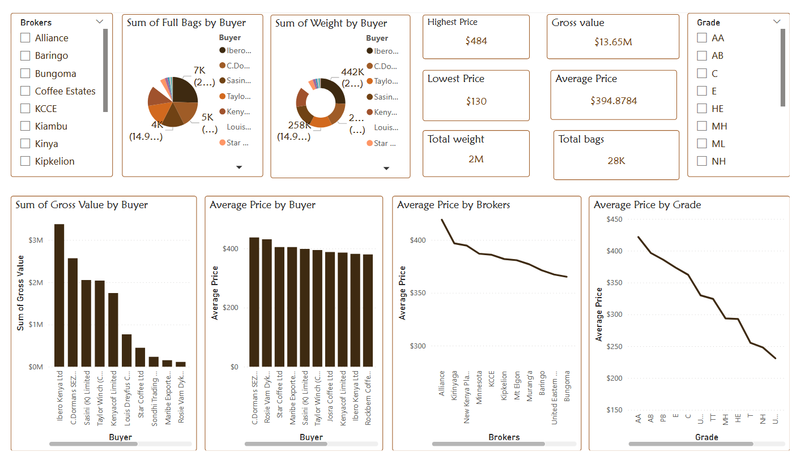
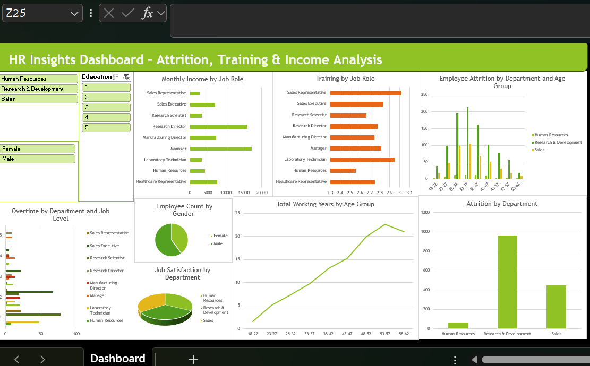
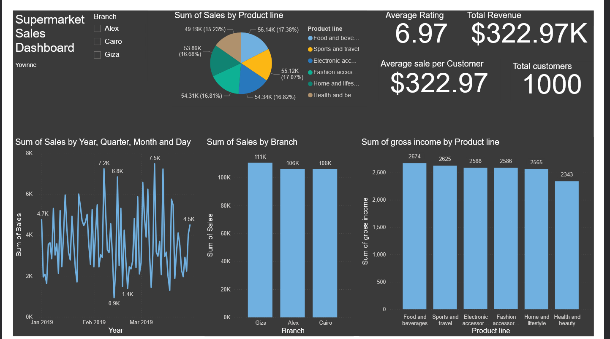

\# Analytics Portfolio

This portfolio contains several data analytics dashboards and projects created using Python, Jupyter Notebook, and various open datasets. Each project has its own folder with a detailed README explaining the analysis, methodology, and results.

\## Projects

\### 1. Coffee Performance Dashboard

\*\*Description:\*\*  

Analysis of coffee sales, broker and buyer performance, and grade trends. The dashboard allows interactive exploration of coffee sales data for Nairobi Coffee Exchange.

\*\*Folder:\*\* `Coffee\_Performance\_Dashboard`

\*\*Screenshots:\*\*  

---

\### 2. HR Dashboard

\*\*Description:\*\*  

Payroll and employee performance dashboard. Includes salary calculations, deductions, allowances, and performance metrics with interactive reporting.

\*\*Folder:\*\* `HR\_Dashboard`

\*\*Screenshots:\*\*  

---

\### 3. Supermarket Dashboard

\*\*Description:\*\*  

Sales and inventory analytics for a supermarket. Tracks product performance, revenue, stock levels, and trends over time.

\*\*Folder:\*\* `Supermarket\_Dashboard`

\*\*Screenshots:\*\*  

---

